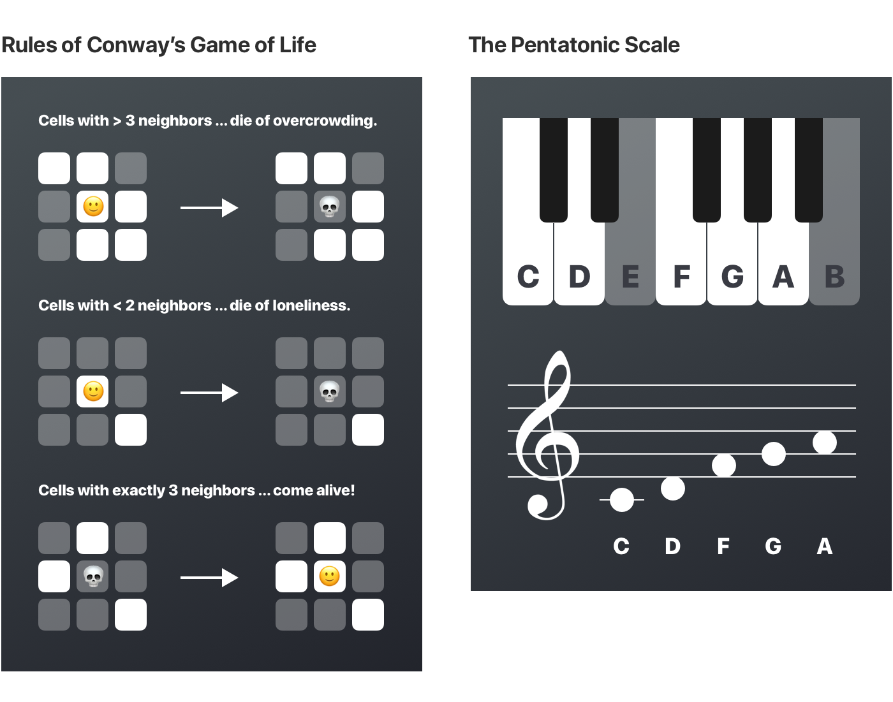

## How it Works
The playground is a cross between a pentatonic tone matrix and Conway’s game of life. It’s an interactive music generation simulation.

Conway’s game of life is a cellular automaton that follows a few simple rules. Based on the number of cells surrounding a given cell, it comes to life, dies, or stays the same. A pentatonic tone matrix is tool to create melodies. Each row corresponds to a note on the pentatonic scale.

The notes in the tone matrix are played left-to-rght. After each pass, the notes change according to the rules above. This creates musical patterns that change and evolve over time.

## Addtional Features
The user can click any cell to toggle its state between alive and dead. They can also select from five presets, which populate the cells with patterns.

For fun, there are three special effects: "colors", "meows", and "party", which add a rainbow effect, replace images with cats and sounds with meows, and add party animations, respectively.

## Context
This playground was created for the WWDC18 scholarship program, which offers tickets to Apple's annual developer conference in San Jose, CA. Applicants submit an interactive Swift playground and written essays which are reviewed by Apple. I was fortunate to be selected as a winner!

More information is available here: https://developer.apple.com/wwdc/scholarships/

## Installation Instructions
1. Download/clone this repo.
2. Open the `PentatonicGameOfLife.playground` file with Xcode 9.3.
3. Follow the instructions in the playground to run.

To modify the playground, I reccomend opening the `ConwayMatrixContainerProject.xcodeproj` file. This project contains a reference to the playground, and allows auto-complete and syntax highlighting for Swift files in the playground's `Sources` folder.

## Liscence
Code is under an MIT liscence. Images and sounds are © 2018 Nathan Gitter and may not be reused in any way.
